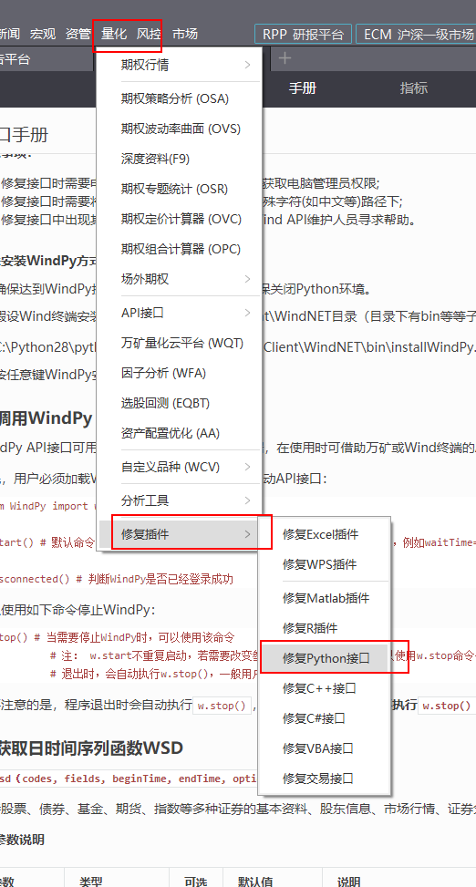

### 注意

同事们，你们好呀！！！

有新问题可以尽情在这里提 ~

我有时间帮大家解决。希望得到提示的可以留自己的邮箱。

------

### 第一步：下载

下载python软件：

https://www.anaconda.com/products/individual 

### 第二步：打开

### 第三步： 把python软件和wind关联起来

### 第四步：利用wind，得到获得数据的代码

### 第五步：利用python软件，在里面编程来处理数据

### 第六步：需要其他命令

百度搜索：

* python画图

* plt python

  

------

### 小知识点

* DataFrame是一种数据格式，方便处理，和excel很像

------

### 小帮手

* 笔记软件可以用Typora

* 有这个图标，就代表用的是公司的电脑，插的网线

  

* 可以用这个浏览器，是可以打开网站的

  https://www.microsoftedgeinsider.com/zh-cn/download/

  

* VPN网址： https://portal.shadowsocks.nl/

  ￥95一年，iOS macos win10 win7 andriod系统均可以。

